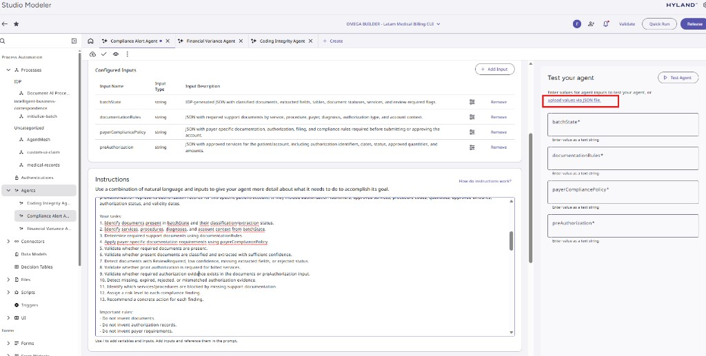

# Prueba manual de agentes en Automate

Cuando los agentes no devuelven valores en el flujo del proceso, conviene
validarlos de forma aislada desde **Studio Modeler** antes de depurar el
conector o el proceso completo.

Esta carpeta contiene exports JSON con los **inputs de prueba** listos para
importar en el panel **Test your agent** de cada agente.

## Archivos disponibles

| Archivo | Agente en Studio |
|---------|------------------|
| `Coding Integrity Agent Test.json` | Coding Integrity Agent |
| `agent-d1aba418-5788-483f-8109-17c71319714b-compliance-alert-age-ia4yd--2026-05-06T03-15-44.json` | Compliance Alert Agent |
| `agent-f8e8070d-d7ee-401f-b5d7-5aeb57a89dd8-financial-agent-siu1f--2026-05-06T03-04-57.json` | Financial Variance Agent |

Cada JSON incluye las variables configuradas del agente (`batchState`,
`documentationRules`, reglas tarifarias, etc.) con datos de ejemplo del flujo de
Cuentas Medicas.

## Pasos para probar en Automate

1. Abre **Studio Modeler** y entra al agente que quieres validar (pestaña
   **Instructions** o vista de configuracion del agente).
2. En el panel derecho **Test your agent**, localiza el enlace
   **upload values via JSON file**.
3. Haz clic en ese enlace y selecciona el JSON correspondiente de esta carpeta.
4. Automate rellenara automaticamente los campos de entrada del agente.
5. Pulsa **Test Agent** y revisa que la respuesta sea JSON no vacio y coherente
   con el escenario esperado.

## Que revisar si falla

- El JSON importado corresponde al **mismo agente** abierto en Studio (inputs y
  nombres deben coincidir).
- Los campos marcados con `*` estan completos tras la importacion.
- El modelo LLM configurado es el baseline validado en la documentacion del
  agente (`docs/Agent Builder Config/*_agent_configuration.md`).
- Si la prueba manual funciona pero el proceso no, el problema suele estar en el
  mapeo de variables del conector AgentMesh o en el script de consolidacion, no
  en las instrucciones del agente.

## Referencia

Configuracion detallada de cada agente:

- `../coding_integrity_agent_configuration.md`
- `../compliance_alert_agent_configuration.md`
- `../financial_variance_agent_configuration.md`
