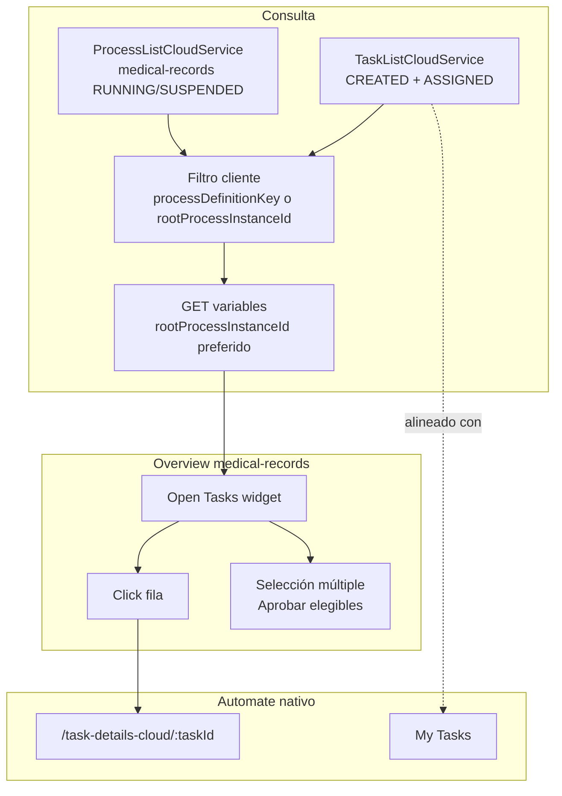

# Procesos, tareas y subprocesos en medical-records

Guía de proyecto para integrar Automate con el plugin `medical-records`. Deriva de
[`reference-docs/hyland/Vibecoding.md`](reference-docs/hyland/Vibecoding.md) (Argumentum / CIC).

## Glosario

| Concepto | Qué es | Qué muestra la UI |
|----------|--------|-------------------|
| **Process instance** | Instancia BPMN en ejecución (`RUNNING`, `SUSPENDED`, …) | Process List nativo |
| **User task** | Paso humano con formulario (`CREATED` sin reclamar, `ASSIGNED` reclamada) | **My Tasks**, dashboard overview |
| **Service task** | Paso automático (IDP, agentes, scripts) | No aparece en My Tasks |
| **Subproceso** | Proceso hijo con **otro** `processInstanceId` | Variables/tareas pueden colgar del sub-ID |
| **`rootProcessInstanceId`** | ID del proceso raíz cuando la tarea vive en un subproceso | Usar para leer `batchState` y contexto |

## Por qué el dashboard no debe listar solo procesos

Una instancia `medical-records` en `RUNNING` puede estar:

- en un service task (IDP, malla agentica),
- esperando en un subproceso,
- o con una user task abierta.

**My Tasks** lista trabajo **ejecutable** (formularios con widgets). El overview del
plugin debe alinearse con eso: **tareas abiertas** (`CREATED` + `ASSIGNED`), no el
conteo de procesos en background.

## APIs en este repo

| Uso | Servicio ADF / endpoint |
|-----|-------------------------|
| App desplegada | `AppConfigService.get('alfresco-deployed-apps')[0].name` |
| Host BPM | `AppConfigService.get('bpmHost')` |
| Listar tareas | `TaskListCloudService.fetchTaskList` → `POST …/query/v1/tasks/search` |
| Variables de proceso | `GET …/query/v1/process-instances/{id}/variables` |
| Documentos HCS | `SearchService` / ECM host (**no** `bpmHost`) |

Implementación: [`MedicalRecordsTaskQueryService`](../../CustomUI/medicalrecords-pq7lr-source/libs/plugins/medical-records/src/lib/dashboard/services/medical-records-task-query.service.ts).

## Flujo de manejo en el dashboard (Custom UI)

### Servicios del plugin

| Servicio | Responsabilidad |
|----------|-----------------|
| [`MedicalRecordsTaskQueryService`](../../CustomUI/medicalrecords-pq7lr-source/libs/plugins/medical-records/src/lib/dashboard/services/medical-records-task-query.service.ts) | Carga tareas abiertas, enriquece con `batchState` y expone estado al widget |
| [`task-attention.mapper.ts`](../../CustomUI/medicalrecords-pq7lr-source/libs/plugins/medical-records/src/lib/dashboard/mappers/task-attention.mapper.ts) | Mapea tarea + variables → fila del dashboard (`taskType`, navegación) |
| [`MedicalRecordsBulkTaskService`](../../CustomUI/medicalrecords-pq7lr-source/libs/plugins/medical-records/src/lib/dashboard/services/medical-records-bulk-task.service.ts) | Evalúa elegibilidad y completa tareas seleccionadas en serie |
| [`task-eligibility.ts`](../../CustomUI/medicalrecords-pq7lr-source/libs/plugins/medical-records/src/lib/dashboard/eligibility/task-eligibility.ts) | Reglas puras de elegibilidad por tipo de tarea |

### Secuencia al cargar el overview

1. Resolver `appName` desde `alfresco-deployed-apps[0].name`.
2. Obtener IDs de instancias raíz `medical-records` en `RUNNING`/`SUSPENDED`.
3. Consultar tareas `ASSIGNED` (usuario actual) y `CREATED` **sin** filtrar por `processDefinitionName` en API.
4. Fusionar, deduplicar por `task.id` y filtrar en cliente:
   - `processDefinitionKey === medical-records`, o
   - `rootProcessInstanceId` pertenece a un root del paso 2 (tareas en subprocesos AgentMesh).
5. Por cada tarea, leer variables del proceso con ID `rootProcessInstanceId ?? processInstanceId`.
6. Pintar filas con paciente/aseguradora desde `batchState`.

### Navegación

| Acción usuario | Destino |
|----------------|---------|
| Click en fila | `/task-details-cloud/{taskId}/{appName}` vía `MedicalRecordService.getTaskDetailsUrl` |
| Nueva intake (shell) | Start process nativo |
| Aprobar elegibles (bulk) | `FormCloudService.completeTaskForm` o `POST .../complete` con `CompleteTaskPayload` |

### Por qué 5 procesos RUNNING ≠ 3 tareas en My Tasks

| Vista nativa | Qué cuenta |
|--------------|------------|
| **Processes → Running** | Instancias BPMN activas (incluye service tasks, subprocesos AgentMesh, esperas) |
| **My Tasks** | Solo user tasks ejecutables (`CREATED` / `ASSIGNED`) |
| **Dashboard overview** | Misma cola que My Tasks (filtrada a medical-records y subprocesos ligados) |

Un proceso puede estar `RUNNING` mientras el usuario no tiene user task pendiente (p. ej. IDP o agentes en background).

## Reglas medical-records

1. **Dashboard / overview** = cola de tareas abiertas del proceso `medical-records`.
2. **Click en fila** → `/task-details-cloud/{taskId}` (widgets: `intake-account-widget`, `analysis-task-widget`, …).
3. **Variables** (`batchState`, `accountId`, …) → leer desde `rootProcessInstanceId` si la tarea está en subproceso; si no, `processInstanceId`.
4. Consultar **CREATED y ASSIGNED** y fusionar resultados (Vibecoding §5.1).
5. Consultar tareas **sin** `processDefinitionName` (como My Tasks); obtener IDs raíz `medical-records` en `RUNNING`/`SUSPENDED` y filtrar en cliente tareas del proceso raíz o de subprocesos (`rootProcessInstanceId`).
6. **Aprobación masiva (custom)** solo desde el overview: seleccionar varias tareas del **mismo tipo** y completar las elegibles sin abrir el formulario. No existe en My Tasks nativo.

## Aprobación masiva elegible

Implementación: [`MedicalRecordsBulkTaskService`](../../CustomUI/medicalrecords-pq7lr-source/libs/plugins/medical-records/src/lib/dashboard/services/medical-records-bulk-task.service.ts) + [`task-eligibility.ts`](../../CustomUI/medicalrecords-pq7lr-source/libs/plugins/medical-records/src/lib/dashboard/eligibility/task-eligibility.ts).

| Tipo de tarea | Criterio de elegibilidad |
|---------------|--------------------------|
| **Nueva Cuenta / Intake** | `readyForAnalysis === true` según `batchState` en Automate |
| **Validate Rules** | secciones agent sin incidencias (`sectionHasIssues === false`) |
| **Analysis** | todos los agentes con `readyForApproval` y sin `requiresManualReview` |

Limitaciones:

- La elegibilidad usa **variables persistidas en Automate**, no cambios locales del widget sin guardar.
- Solo se pueden mezclar tareas del mismo tipo en una operación.
- Las completaciones van en serie (`CompleteTaskPayload` / `completeTaskForm`).

## Gotchas aplicables

| Síntoma | Causa | Acción |
|---------|-------|--------|
| My Tasks tiene ítems, dashboard no | Dashboard consultaba `process-instances` o filtraba solo `processDefinitionName: medical-records` | Usar `TaskListCloudService` + incluir tareas en subprocesos vía `rootProcessInstanceId` |
| Tareas “fantasma” en cola | Solo se consultó `ASSIGNED` | Incluir también `CREATED` |
| `batchState` vacío en subproceso | Variables leídas del sub-ID | Usar `rootProcessInstanceId` |
| Documentos 404 | Request a Studio en vez de ECM | Usar `ecmHost` / Content Services |
| Start/complete silencioso | Falta `payloadType` | `StartProcessPayload` / `CompleteTaskPayload` |

## Referencias

- Guía completa CIC: [`reference-docs/hyland/Vibecoding.md`](reference-docs/hyland/Vibecoding.md)
- Plugin: [`medical-records-plugin.md`](medical-records-plugin.md)
- Demo end-to-end: [`../medical-records-demo-process-specification.md`](../medical-records-demo-process-specification.md)
