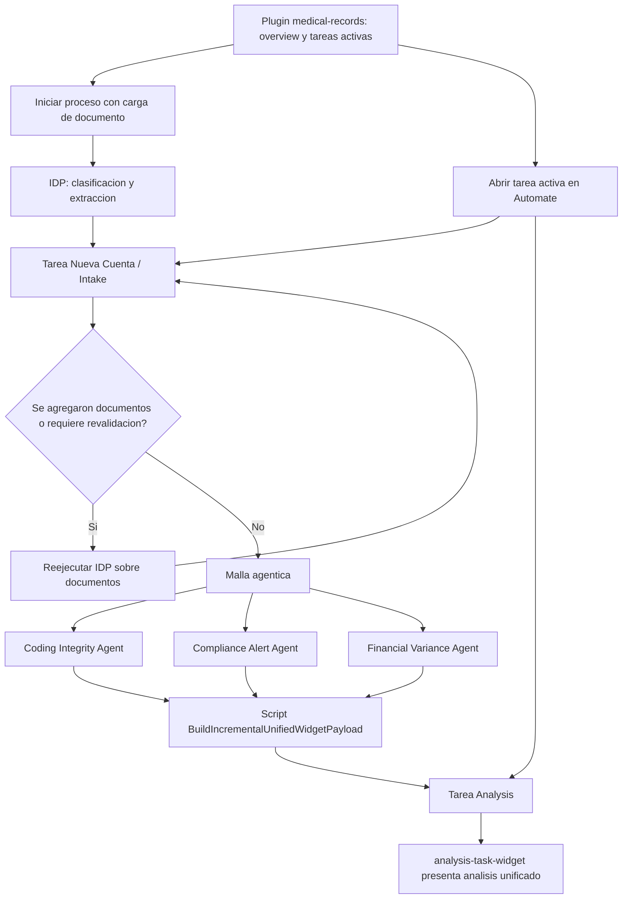

# Medical Records Demo Process Specification

Fecha: 2026-05-03.

Este es el documento general de la demo de Cuentas Medicas. Debe funcionar como
la fuente principal para entender el paso a paso del proceso, las etapas de
Automate, los widgets de Custom UI, los agentes, las variables y los contratos
tecnicos necesarios.

Los documentos especificos de widgets, Agent Builder y desarrollo local quedan
como anexos tecnicos para cambios puntuales, pero la narrativa end-to-end de la
demo debe mantenerse aqui.

## Resumen ejecutivo

La demo muestra como Hyland CIC, Automate, IDP, Agent Builder y Custom UI pueden
orquestar una cuenta medica desde la carga inicial de documentos hasta la
prevalidacion inteligente antes de aprobacion.

Decision arquitectonica vigente:

- Las etapas reales del workflow no se implementan como pantallas internas del
  plugin general.
- Cada etapa operativa vive en una tarea de Automate y se personaliza mediante
  un custom form widget.
- El plugin `medical-records` funcionara como overview/entrada operacional:
  muestra el estado general y redirige a las tareas en ejecucion para continuar
  el flujo puntual.
- Esta decision evita recrear toda la interfaz personalizada desacoplada del
  workflow y permite traer informacion controladamente desde Automate hacia cada
  formulario.

El flujo implementado y configurado para la primera version funcional cubre:

1. Inicio del proceso cargando un documento.
2. Clasificacion/extraccion documental con IDP.
3. Tarea `Nueva Cuenta` para intake y revision documental.
4. Bifurcacion posterior a intake:
   reejecutar IDP si se agregan documentos o continuar a la malla agentica.
5. Ejecucion de tres agentes:
   Coding Integrity, Compliance Alert y Financial Variance.
6. Consolidacion generica de resultados en un envelope JSON.
7. Tarea `Analysis` con un unico custom form widget que presenta el analisis
   unificado.

Las etapas posteriores de la demo deben modelarse como futuras tareas/widgets,
no como paginas de fase dentro del plugin general, salvo que se decida construir
una experiencia full custom desacoplada e integrada por servicios.

## Arquitectura tecnica de la demo

### Plataforma

- Hyland Content Innovation Cloud.
- Hyland Automate / Studio Modeler.
- IDP para clasificacion y extraccion documental.
- Agent Builder para agentes de prevalidacion.
- Custom UI exportada desde Automate con Angular/Nx.
- Plugin custom `medical-records`.

### Custom UI

Ruta principal del proyecto:

```text
CustomUI/medicalrecords-pq7lr-source/
```

Plugin de la demo:

```text
CustomUI/medicalrecords-pq7lr-source/libs/plugins/medical-records/
```

Ruta principal del plugin:

```text
/medical-records
```

Regla de arquitectura:

- La shell nativa de Hyland se preserva.
- El plugin agrega un overview de Cuentas Medicas dentro del shell.
- El plugin no debe ser la fuente de verdad de las etapas del workflow.
- La pantalla principal del plugin, aun pendiente de ajuste final, debe mostrar
  un overview sin navegacion por etapas y permitir abrir/redirigir a las tareas
  activas de Automate.
- Las acciones nativas de Automate en tareas (`Save`, `Cancel`, `Complete`) no
  se reemplazan por acciones custom.
- Los widgets personalizan la visualizacion y lectura de datos, pero no
  completan tareas ni mutan variables en esta version.

Nota: durante una etapa inicial se construyeron rutas/pantallas visuales por
fase dentro del plugin para seguir los mockups de Stitch. Esa direccion queda
como referencia visual o historica, no como modelo funcional vigente.

### Widgets actuales

```text
intake-account-widget
analysis-task-widget
```

`intake-account-widget` vive en la tarea `Nueva Cuenta` y lee `batchState`.

`analysis-task-widget` vive en la tarea `Analysis` y lee
`unifiedWidgetPayloadText`.

## Flujo end-to-end actual



## Etapa 0 - Inicio del proceso

### Objetivo

Crear una instancia del proceso de cuenta medica a partir de la carga inicial de
un documento.

### Estado actual

El flujo de Automate esta configurado para que la accion principal de prueba sea
iniciar el proceso cargando un documento. Ese documento sera usado como entrada
para IDP y para construir el contexto inicial de la cuenta.

### Entrada esperada

- Documento medico o administrativo de prueba.
- Puede ser factura, desglose, autorizacion, soporte clinico u otro documento
  usado por el proceso.

### Resultado esperado

- Se crea una instancia del proceso.
- IDP procesa el documento inicial.
- Se genera o actualiza el estado documental del lote.
- Automate crea la tarea `Nueva Cuenta`.

### Elementos tecnicos

- Proceso Automate: `medical-records`.
- Documento inicial en repositorio / contexto del proceso.
- Salida IDP usada como `batchState`.

## Etapa 1 - IDP y estructuracion documental

### Objetivo

Clasificar documentos, extraer campos clave y producir el estado estructurado de
la cuenta para intake.

### Capacidades funcionales

- Captura de documentos heterogeneos.
- Clasificacion automatica por tipo documental.
- Extraccion de campos clave.
- Extraccion de tablas cuando aplica.
- Agrupacion documental por cuenta/paciente/factura.
- Preparacion de `batchState` para el widget de intake.

### Documentos observados en ejemplos

- `Factura y Desglose`.
- `Formato de Autorizacion`.
- `Formulario de Objeciones Auditoria Medica`.
- `Reporte de Patologia`.
- `Laboratorios`.

### Salida principal

```text
batchState
```

`batchState` puede llegar como objeto JSON o string JSON parseable.

### Uso posterior

La tarea `Nueva Cuenta` usa `batchState` como entrada principal del
`intake-account-widget`.

## Etapa 2 - Nueva Cuenta / Intake

### Objetivo

Permitir al usuario revisar la cuenta inicial, entender servicios/documentos,
cargar soportes adicionales si es necesario y decidir si la cuenta puede avanzar
a analisis.

### Tarea Automate

```text
Nueva Cuenta
```

### Widget principal

```text
intake-account-widget
```

### Contrato de datos

El widget lee `batchState` desde:

```text
this.field.value
this.field.form.getFieldById("batchState")?.value
```

Soporta:

- objeto JSON
- string JSON parseable

Si el payload no puede parsearse o no trae documentos, muestra un estado de
error amigable.

### Experiencia de usuario

El widget no es un formulario vertical clasico. Es una vista operacional de la
cuenta medica con:

- navegacion de etapa
- banner de reconciliacion OCR
- selector de paciente si existen multiples cuentas reales
- header de paciente/cuenta
- cards de resumen
- Service Explorer
- Document Control Center
- readiness consolidada

### Service Explorer

Cada servicio facturado se presenta como card expandible con:

- fecha
- codigo de servicio
- CUPS/CUP
- descripcion
- cantidad
- precio
- porcentaje de completitud documental
- estado de soporte
- soportes requeridos
- soportes presentes
- soportes faltantes
- documento fuente
- confianza de extraccion

Estados actuales:

- `Complete`
- `Partial`
- `Missing Support`
- `Review Required`
- `Low Confidence`

### Document Control Center

Cada documento puede mostrar:

- `className`
- estado general
- `classificationStatus`
- `extractionStatus`
- `classificationConfidence`
- `extractionReviewStatus`
- `separationReviewStatus`
- highlights extraidos

### Heuristicas actuales

El widget todavia usa heuristicas locales para:

- relacionar servicios con soportes requeridos
- calcular `readyForAnalysis`
- marcar `Low Confidence`
- agrupar variantes OCR del mismo paciente

Estas heuristicas habilitan la primera version funcional, pero no reemplazan una
matriz oficial de reglas de negocio.

### Acciones actuales

- `Save`, `Cancel` y `Complete` siguen siendo acciones nativas de Automate.
- La seleccion visual de alias de paciente es local al componente.
- El widget todavia no escribe valores de vuelta al formulario.
- Acciones como `Upload`, `Acquire Document`, `Upload Manually`, `Mark as
  Reviewed` y `View` siguen siendo visuales o futuras, segun el caso.

### Decision al completar

Al completar `Nueva Cuenta`, el flujo puede:

1. Reejecutar IDP si se cargaron documentos nuevos o se requiere revalidacion.
2. Continuar a la malla agentica si la cuenta esta lista.

## Etapa 3 - Reejecucion IDP opcional

### Objetivo

Actualizar el estado de la cuenta cuando el usuario agrega documentos o cuando
la cuenta necesita una nueva validacion documental.

### Condiciones de entrada

- Se cargaron documentos adicionales durante `Nueva Cuenta`.
- La extraccion previa no es suficiente.
- Hay informacion documental incompleta o de baja confianza.

### Resultado esperado

- IDP procesa o reprocesa los documentos.
- `batchState` se actualiza.
- El flujo puede regresar a `Nueva Cuenta` para nueva revision o continuar a la
  malla agentica.

### Consideraciones

Este loop permite que la demo muestre un comportamiento realista: el usuario no
queda forzado a avanzar con una cuenta incompleta, sino que puede enriquecer el
expediente y revalidarlo.

## Etapa 4 - Malla agentica

### Objetivo

Ejecutar analisis automaticos especializados antes de presentar la etapa
`Analysis`.

La malla actual tiene tres agentes. Cada agente produce un outcome string con
JSON estructurado.

### Agent 1 - Coding Integrity Agent

Outcome:

```text
codingIntegrityResult
```

Responsabilidad:

- validar consistencia entre procedimientos, diagnosticos y codigos
- detectar incompatibilidades
- detectar duplicados
- identificar soporte diagnostico faltante
- recomendar ajustes de codificacion

Campos esperados en el resultado:

- `agentName`
- `overallRiskLevel`
- `summary`
- `codingSummary`
- `findings`
- `recommendedActions`
- `readyForApproval`
- `requiresManualReview`

### Agent 2 - Compliance Alert Agent

Outcome:

```text
complianceAlertResult
```

Responsabilidad:

- validar completitud documental
- detectar documentos obligatorios faltantes
- revisar autorizaciones y soportes
- identificar servicios bloqueados por falta de soporte
- recomendar solicitud de documentos o autorizaciones

Campos esperados en el resultado:

- `agentName`
- `overallRiskLevel`
- `summary`
- `complianceSummary`
- `missingDocuments`
- `findings`
- `recommendedActions`
- `readyForApproval`
- `requiresManualReview`

### Agent 3 - Financial Variance Agent

Outcome:

```text
financialVarianceResult
```

Responsabilidad:

- analizar consistencia financiera
- comparar valores facturados contra tarifas esperadas
- detectar desviaciones tarifarias
- revisar montos autorizados
- calcular variancias

Campos esperados en el resultado:

- `agentName`
- `overallRiskLevel`
- `summary`
- `analyzedTotals`
- `authorizationSummary`
- `findings`
- `recommendedActions`
- `readyForApproval`
- `requiresManualReview`

### Reglas de frontend

El frontend no reejecuta reglas como `codingRules`, `tariffAgreement` o
`payerCompliancePolicy`. Esas reglas pertenecen a Agent Builder/Automate.

El widget solo:

- presenta resultados
- cruza hallazgos
- calcula metricas visuales
- bloquea aprobacion si faltan agentes, hay JSON invalido o algun agente exige
  revision manual

## Etapa 5 - Consolidacion de resultados

### Objetivo

Unificar los resultados de agentes en un envelope JSON generico que pueda crecer
con agentes futuros sin cambiar el script.

### Script

```text
docs/Agent Builder Config/BuildIncrementalUnifiedWidgetPayload.ts
```

### Entradas

El script acepta:

```text
variables.json1 ... variables.json10
```

Mapeo actual:

```text
json1 = codingIntegrityResult
json2 = complianceAlertResult
json3 = financialVarianceResult
```

Tambien puede recibir un envelope previo para preservar agentes existentes.

### Salidas

```text
variables.unifiedWidgetPayload
variables.unifiedWidgetPayloadText
```

Para el formulario de `Analysis`, usar:

```text
unifiedWidgetPayloadText
```

### Estructura del envelope

```json
{
  "schemaVersion": "incremental-widget-payload-envelope/v1",
  "generatedAt": "2026-05-03T00:00:00.000Z",
  "source": "Automate Script - BuildIncrementalUnifiedWidgetPayload",
  "agents": {
    "codingIntegrityAgent": {
      "status": "AVAILABLE",
      "slotName": "json1",
      "agentKey": "codingIntegrityAgent",
      "agentName": "Coding Integrity Agent",
      "result": {}
    }
  },
  "agentOrder": ["codingIntegrityAgent"],
  "warnings": [],
  "summary": {}
}
```

### Manejo de errores

- Input vacio: se ignora y no borra resultados previos.
- Input invalido: se registra en `warnings`.
- JSON doblemente encodeado: el script intenta parsearlo de forma profunda.
- El script no debe crear una salida especifica del widget como
  `analysisWidgetPayload`.

## Etapa 6 - Analysis

### Objetivo

Centralizar el analisis de los tres agentes y presentarlo como una consola de
decision para el usuario.

### Tarea Automate

```text
Analysis
```

### Formulario

El formulario de `Analysis` debe tener un unico campo funcional:

```text
analysis-task-widget
```

Mapeo:

```text
analysis-task-widget -> unifiedWidgetPayloadText
```

No mapear como campos visibles separados:

```text
codingIntegrityResult
complianceAlertResult
financialVarianceResult
case_payload
caseJSON
```

### Widget principal

```text
analysis-task-widget
```

### Resolucion de agentes

El widget lee `field.value` y busca un envelope con `agents`.

Para resolver cada tarjeta usa:

1. key directa: `codingIntegrityResult`, `complianceAlertResult`,
   `financialVarianceResult`
2. key del mapa `agents`
3. `agent.agentKey`
4. `agent.slotName`
5. `agent.agentName` o `agent.name`
6. `agent.result.agentName` o `agent.result.name`

Fallback actual:

```text
Coding Integrity   -> tokens CODING + INTEGRITY, fallback json1
Compliance Alert   -> tokens COMPLIANCE + ALERT, fallback json2
Financial Variance -> tokens FINANCIAL + VARIANCE, fallback json3
```

### UI actual

La consola muestra:

- resumen de metricas
- score de riesgo de glosa
- tarjeta de Coding Integrity
- tarjeta de Compliance Alert
- tarjeta de Financial Variance
- acciones recomendadas
- tabla de billed items
- estado de aprobacion

### Mapeo funcional

| UI | Fuente |
|---|---|
| Inconsistencies | `codingIntegrityResult.findings.length` |
| Missing Docs | `complianceAlertResult.complianceSummary.missingRequiredDocuments` o `missingDocuments.length` |
| Tariff Deviations | `financialVarianceResult.findings` filtrado por `TARIFF_DEVIATION` |
| Risk Score | mayor riesgo entre agentes y findings |
| Coding Integrity Card | primer finding HIGH/CRITICAL de coding |
| Compliance Alert Card | primer finding HIGH/CRITICAL de compliance |
| Financial Variance Card | primer finding financiero, priorizando `TARIFF_DEVIATION` |
| Billed Items Analysis | union por `serviceCode`, `procedureCode` o `findingId` |
| Approve Proceed | habilitado solo si los tres agentes estan listos y ninguno exige revision manual |

### Estados

- Resultado faltante: `Pending agent result`.
- JSON invalido: `Invalid agent JSON`.
- Datos parciales: renderiza lo disponible y bloquea aprobacion.
- Moneda: usa `financialVarianceResult.analyzedTotals.detectedCurrency`; fallback
  `COP`.

### Acciones actuales

Los botones internos son visuales en v1:

- `Update CUPS`
- `Request Authorization`
- `Review Contract`
- `Reject/Adjust`
- `Approve Proceed`

No completan tareas ni mutan variables de Automate en esta version.

## Etapa 7 - Approval / Account Assembly

### Estado actual

Existe como etapa conceptual del proceso, pero no debe implementarse por ahora
como pantalla de fase dentro del plugin general.

Cuando se implemente, deberia ser una tarea/formulario de Automate con su propio
widget o con los campos necesarios para esa etapa. El plugin overview solo
deberia permitir abrir la tarea activa correspondiente.

### Objetivo funcional esperado

- revisar que la cuenta este lista despues del analisis
- consolidar ajustes recomendados
- preparar paquete de envio
- validar formatos requeridos por aseguradora/convenio
- generar o revisar RIPS u otros formatos

### Estado de implementacion

Pendiente de profundizacion funcional. No hay widget real equivalente a
`intake-account-widget` o `analysis-task-widget`.

## Etapa 8 - Execution / Gestion de envio o apelaciones

### Estado actual

Existe como etapa conceptual del proceso, pero no debe implementarse por ahora
como pantalla de fase dentro del plugin general.

En el alcance amplio de Cuentas Medicas, esta etapa podria vivir como una o mas
tareas/widgets de Automate para envio trazable, gestion de respuestas, glosas o
apelaciones segun el escenario de la demo.

### Objetivo funcional esperado

- ejecutar envio trazable a la aseguradora
- registrar fecha, canal y acuse
- gestionar respuestas o rechazos tecnicos
- apoyar apelaciones si el flujo se orienta a glosas

### Estado de implementacion

Pendiente de definicion detallada para la demo actual.

## Etapa 9 - Review / Revision final

### Estado actual

Existe como etapa conceptual del proceso, pero no debe implementarse por ahora
como pantalla de fase dentro del plugin general.

### Objetivo funcional esperado

- auditoria final de la cuenta o del caso
- revisar trazabilidad documental
- revisar decisiones tomadas en intake y analysis
- confirmar que no quedan bloqueos antes de cierre

### Estado de implementacion

Pendiente de definicion funcional y tecnica.

## Etapa 10 - Completed / Conciliacion y cierre

### Estado actual

Existe como etapa conceptual del proceso, pero no debe implementarse por ahora
como pantalla de fase dentro del plugin general.

### Objetivo funcional esperado

- cierre del expediente
- conciliacion de pagos
- trazabilidad de glosas, apelaciones, acuerdos y pago
- metricas finales de ciclo
- retroalimentacion de conocimiento para futuras cuentas

### Estado de implementacion

Pendiente de definicion funcional y tecnica.

## Variables y contratos principales

| Variable | Tipo esperado | Productor | Consumidor | Uso |
|---|---|---|---|---|
| `batchState` | JSON/string JSON | IDP/Automate | `intake-account-widget` | estado documental y servicios en intake |
| `codingIntegrityResult` | string JSON | Coding Integrity Agent | script generico | analisis de codificacion |
| `complianceAlertResult` | string JSON | Compliance Alert Agent | script generico | analisis documental/compliance |
| `financialVarianceResult` | string JSON | Financial Variance Agent | script generico | analisis financiero/tarifario |
| `unifiedWidgetPayload` | JSON object | script generico | Automate/futuro | envelope consolidado si el target soporta JSON |
| `unifiedWidgetPayloadText` | string JSON | script generico | `analysis-task-widget` | envelope consolidado para formulario |

## Archivos tecnicos relevantes

### Plugin y shell

```text
CustomUI/medicalrecords-pq7lr-source/libs/plugins/medical-records/
CustomUI/medicalrecords-pq7lr-source/libs/plugins/medical-records/src/lib/pages/medical-records-shell/
```

### Intake widget

```text
CustomUI/medicalrecords-pq7lr-source/libs/plugins/medical-records/src/lib/form-widgets/intake-account-widget/
```

Documentacion interna:

```text
docs/custom-ui/intake-account-widget.md
```

### Analysis widget

```text
CustomUI/medicalrecords-pq7lr-source/libs/plugins/medical-records/src/lib/form-widgets/analysis-task-widget/
```

Documentacion interna:

```text
docs/custom-ui/analysis-task-widget-poc.md
docs/Agent Builder Config/analysis_widget_payload_integration.md
```

### Agent Builder

```text
docs/Agent Builder Config/coding_integrity_agent_configuration.md
docs/Agent Builder Config/compliance_alert_agent_configuration.md
docs/Agent Builder Config/financial_variance_agent_configuration.md
docs/Agent Builder Config/BuildIncrementalUnifiedWidgetPayload.ts
```

### Ejemplos de datos

```text
docs/Examples/
```

## Validacion manual end-to-end

Checklist recomendado:

1. Iniciar el proceso `medical-records` cargando un documento.
2. Confirmar que IDP clasifica y extrae datos.
3. Confirmar que se crea la tarea `Nueva Cuenta`.
4. Abrir `Nueva Cuenta` y validar que `intake-account-widget` lee `batchState`.
5. Validar servicios, documentos, soportes faltantes y readiness.
6. Cargar documentos adicionales si se quiere probar el loop.
7. Completar `Nueva Cuenta`.
8. Confirmar camino de reejecucion IDP o avance a malla agentica.
9. Confirmar que los tres agentes generan outcomes string JSON.
10. Confirmar que el script genera `unifiedWidgetPayloadText` con `agents`.
11. Confirmar que se crea/abre la tarea `Analysis`.
12. Confirmar que el formulario de `Analysis` tiene solo
    `analysis-task-widget` como campo funcional.
13. Confirmar que el widget muestra las tres tarjetas de agentes.
14. Probar casos con un agente faltante.
15. Probar un resultado JSON invalido y confirmar `Invalid agent JSON`.
16. Confirmar que `Approve Proceed` queda bloqueado cuando corresponde.

## Estado actual de implementacion

### Listo para primera prueba funcional

- Plugin `medical-records`.
- Overview/plugin shell como punto de entrada.
- `intake-account-widget` leyendo `batchState`.
- `analysis-task-widget` leyendo `unifiedWidgetPayloadText`.
- Tres agentes documentados.
- Script generico de consolidacion.
- Flujo conceptual de intake, re-IDP, malla agentica y analysis.

### Pendiente o fuera de v1

- Ajustar la pantalla principal del plugin para que muestre solo overview y
  tareas activas, sin navegacion interna por etapas.
- Persistir interacciones visuales de widgets en variables de Automate.
- Ejecutar acciones internas de los widgets.
- Endurecer reglas oficiales de negocio en backend.
- Definir widgets reales para `Approval`, `Execution`, `Review` y `Completed`.
- Validar end-to-end con documento real de prueba.
- Ejecutar build/test/lint cuando se autorice.

## Reglas para mantener esta documentacion

- Cualquier cambio general del proceso debe actualizar este documento primero.
- Los documentos de widgets deben conservar detalles internos de implementacion,
  decisiones visuales y cambios incrementales.
- Los documentos de Agent Builder deben conservar prompts, schemas y checklists
  tecnicos.
- Si cambia el contrato entre Automate y un widget, actualizar aqui la seccion
  de variables, etapa correspondiente y checklist end-to-end.
